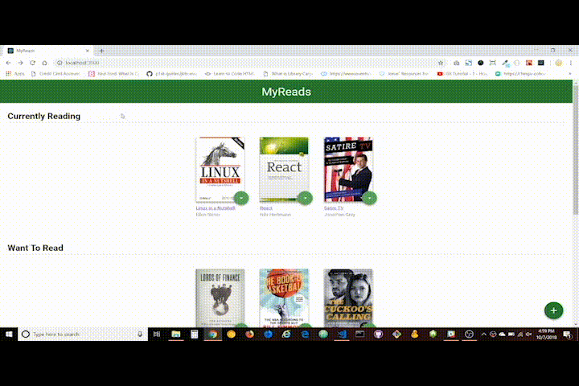
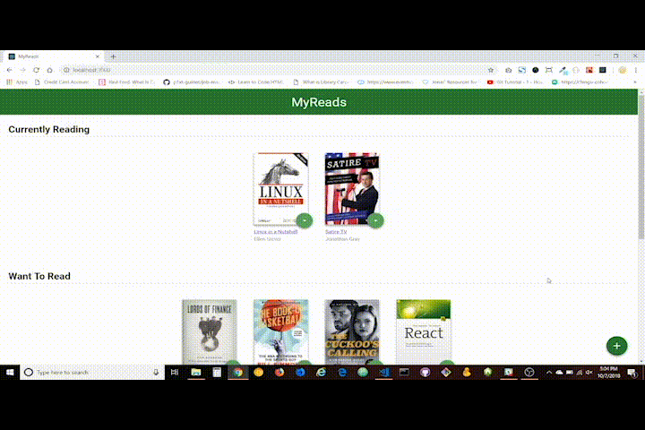

# MyReads Project

This is the starter template I received for the sixth project for Udacity's Front End Nanodegree course. The goal of this template is to save time by providing a static example of the CSS and HTML markup that may be used, but without any of the React code that is needed to complete the project. I chose to start with this template and add interactivity to the app by refactoring the static code in this template.

## TL;DR

To see the project right away:

* Download or clone the repository
* install all project dependencies with `npm install`
* start the development server with `npm start`

## Project Functionality

* A main page that provides you three shelves for your books and allows you to change each book to a different shelf and see the outcome immediately:



* A search page that allows you to search for books (within defined limits) and add the shelf of your choice:



* React Router is also used to handle movement between these two pages.


## What We Received
```bash
├── CONTRIBUTING.md
├── README.md - This file.
├── SEARCH_TERMS.md # The whitelisted short collection of available search terms for you to use with your app.
├── package.json # npm package manager file. It's unlikely that you'll need to modify this.
├── public
│   ├── favicon.ico # React Icon, You may change if you wish.
│   └── index.html # DO NOT MODIFY
└── src
    ├── App.css # Styles for your app. Feel free to customize this as you desire.
    ├── App.js # This is the root of your app. Contains static HTML right now.
    ├── App.test.js # Used for testing. Provided with Create React App. Testing is encouraged, but not required.
    ├── BooksAPI.js # A JavaScript API for the provided Udacity backend. Instructions for the methods are below.
    ├── icons # Helpful images for your app. Use at your discretion.
    │   ├── add.svg
    │   ├── arrow-back.svg
    │   └── arrow-drop-down.svg
    ├── index.css # Global styles. You probably won't need to change anything here.
    └── index.js # You should not need to modify this file. It is used for DOM rendering only.
```

## Backend Server

To simplify your development process, we've provided a backend server for you to develop against. The provided file [`BooksAPI.js`](src/BooksAPI.js) contains the methods you will need to perform necessary operations on the backend:

* [`getAll`](#getall)
* [`update`](#update)
* [`search`](#search)

## Important
The backend API uses a fixed set of cached search results and is limited to a particular set of search terms, which can be found in [SEARCH_TERMS.md](SEARCH_TERMS.md). That list of terms are the _only_ terms that will work with the backend, so don't be surprised if your searches for Basket Weaving or Bubble Wrap don't come back with any results.

## Acknowledgements

The Udacity community was very helpful, including the group on Slack and [Ryan Waite's walkthrough](https://youtu.be/acJHkd6K5kI).
